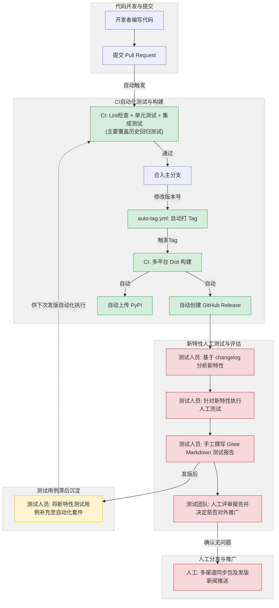
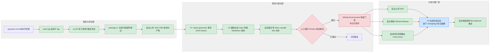

# RuyiSDK 包管理器自动化发版与测试流程优化汇报
## 一、 当前发布流程现状
当前 `ruyi` 包管理器的发布与测试流程呈现出“构建发版高度自动化，新特性测试与分发推广高度人工化且存在滞后割裂”的特点。
### 1. 当前流程图

### 2. 流程描述与自动化程度说明
*   **全自动化环节（绿色）**：
    *   **回归测试与代码检查**：PR 提交后，自动触发 Lint 检查、单元测试和集成测试，但此时主要覆盖的是历史功能的回归验证。
    *   **版本打标与产物构建**：版本号变更后，自动打 Tag，并针对 Linux/Windows/macOS 多平台构建可执行文件。
    *   **基础渠道发版**：自动创建 GitHub Release 页面，并将 Wheel 包发布至 PyPI（此动作发生在人工新特性测试之前）。
*   **纯人工环节（红色）**：
    *   **新特性人工测试**：发版后，测试人员需根据自动生成的 changelog 分析本次引入的新特性，并对其进行人工手动测试。
    *   **测试报告生成与评审**：基于人工测试结果，手工撰写 Gitee 测试报告并进行人工评审，以此作为对外推广的质量依据。
    *   **多渠道分发与推广**：评审通过后，由人工完成发版包的多渠道同步及发版新闻推送。
*   **测试用例滞后沉淀环节（黄色）**：
    *   **事后补测机制**：针对本次发版新特性的自动化测试用例，通常是在**发版后**由测试人员编写并补充到 `ruyi-pytest` 等测试套件中。这些新增的用例只能在**下一次**发版时参与自动化执行。这种模式导致了研发与测试的割裂，拉长了新特性的有效验证周期。
---
## 二、 优化后的发布流程（全链路自动化方案）
针对现状中的人工瓶颈，设计以下全链路自动化优化方案，通过引入结构化测试产物、AI内容生成与审批门禁，实现“测试-报告-评审-分发-推广”的闭环自动化。
### 1. 优化后流程图

### 2. 方案核心价值
*   **测试报告自动化**：释放测试人员约 60-70% 的报告撰写工作量，测试结果实时归档。
*   **分发与推广自动化**：包分发与发版新闻推送实现无人值守。
*   **AI 赋能切入点**：AI 接入测试日志生成缺陷草案，接入 Changelog 生成发版新闻，降低运营与测试双重成本。
---
## 三、 优化方案存在的问题及后续进一步优化策略
尽管上述全链路自动化方案解决了“执行后”的流程断点，但在“执行前”和“需求源头”仍存在深层次问题，需在后续规划中进一步优化：
### 问题1：新特性测试用例覆盖滞后导致人工干预增加
**问题剖析**：
自动化流程极大地保障了历史功能的回归测试效率，但面临新特性覆盖的问题。如果发版修改的代码引入了新功能，而开发者未同步补充单元测试和集成测试用例，现有的 CI 流水线依然会因“未覆盖到新代码”而“绿灯”通过。此时，发版质量并非存在盲区，而是由后续的**人工测试环节**来补位。这虽然保障了质量，但导致流程增加了大量的人工干预和介入，拉长了发布周期，未能充分发挥自动化的效能。

**后续优化方案**：
*   **流程约束**：建立 PR 模板，要求提交新功能 PR 时，必须勾选或关联对应的测试用例更新（哪怕只是测试用例骨架）。
*   **AI 赋能测试左移**：引入 AI 工具，基于 PR 的 diff 代码变动，自动生成单元测试用例草案供开发者参考和完善，降低编写测试用例的门槛。

### 问题2：发版依据缺失及测试与研发割裂
**问题剖析**：
当前流程中，代码修改的前置需求依据相对缺失。受既往“小步快跑”的发版策略影响，实际操作演变成了“滞后测试”模式：先打 Release，再根据 changelog 分析是否需要新增测试用例，人工测试通过后才算完成发版。这种模式导致测试用例开发与代码研发割裂，拉长了有效验证周期。

**策略调整共识**：
经沟通评估，“固定发版时间频率”本质是一种管理需求，是可以协商调整的。只要能向用户明确传达“下个版本解决什么问题”以及“大致的发布时间范围”，并尽量保障内容和质量，即可满足用户期待。因此，发版约束可从“固定频率”转向“发布计划与质量驱动”。

**后续优化方案（轻量级落地版）**：
基于上述策略调整，无需引入重型项目管理流程，通过以下易操作的机制即可实现测试与研发的同步：
1.  **轻量化发布计划管理（基于 GitHub Milestone）**：
    利用 GitHub 现有的 Milestone 功能管理发布计划。每个 Milestone 代表一个待发版本，明确纳入需解决的 Issue，并标注大致的时间范围（如“预计X月上旬”）。当 Milestone 内规划的核心 Issue 均已开发完成并合并时，即视为满足发版条件。
2.  **PR 级别的测试左移卡点**：
    将测试用例的开发从“发版后”提前至“代码开发时”。制定合入规范：**涉及新功能或缺陷修复的 PR，必须同步提交或关联对应的测试用例（单测或 ruyi-pytest 提交）**。未附带测试用例的新特性 PR 不予合入。这样在发版触发自动化测试时，CI 能够直接覆盖最新特性，彻底消除人工事后补测环节。
3.  **AI 辅助计划跟踪与内容生成**：
    利用 AI 赋能运营，定期读取 Milestone 下的 Issue 完成状态。当进度达到发版阈值时，AI 自动汇总已完成的 Issue 生成 Changelog 草案及发版预告（包含版本内容和大致时间），推送到内部沟通渠道，以极低的人力成本弥补原流程中“计划文档缺失”的问题，使发版过程更具确定性和透明度。
