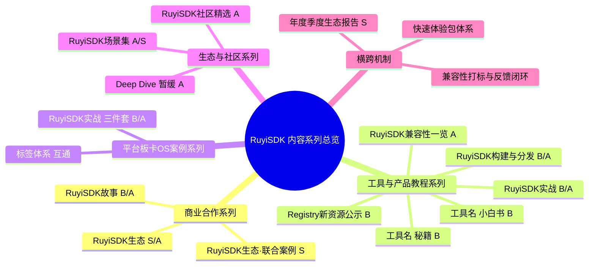

# RuyiSDK生态建设——内容建设篇
## 章节一：内容总览
### 1.1 核心原则
- **统一品牌命名：** 所有正式对外内容统一使用"RuyiSDK"，避免"Ruyi"单品牌可能引发的混淆（如如意、RuyiAI、OpenRuyi等）。
- **全员运营体系：** 严格沿用proposal-001中的"模块负责人定调 + 宣发人员再创 + S/A/B/C四级 + 渠道匹配 + 定调会SOP"规范。

### 1.2 内容形态全景
RuyiSDK的内容产出涵盖以下五种核心形态，同一RuyiSDK实战案例建议拆解为图文、视频、快速体验包三种形态分别输出：
| 形态 | 说明 | 适用场景 |
|------|------|---------|
| **图文博客/教程** | 包括技术文章、操作教程、案例拆解、生态报告等 | 官网新闻/Blog、论坛帖、公众号推文、合作媒体稿件 |
| **视频教程/录屏** | 包括实操演示、环境配置、功能速览、会议录播 | B站（已开通官方账号）、视频号、会议录播 |
| **快速体验包** | 工具链+镜像+示例工程+一键脚本+声明式清单，配套Registry卡片 | 降低上手门槛，关联RuyiSDK实战案例三件套的重要一环 |
| **直播/会议分享** | 包括Office Hours、行业会议演讲、线上分享会 | RuyiSDK Office Hours（双周四15:00）、RISC-V行业双周会、RVI OpenHours |
| **元数据/资源公开** | packages-index新增资源、兼容性打标、changelog等 | Registry新资源公示（B级双周公告）、双周进展摘要 |

### 1.3 内容系列规划总图
以下按四个一级分类展开，每个系列已标注建议级别（S/A/B/C），与proposal-001的定级规则对齐。

---
**第一大分类：商业合作系列**
| 系列名 | 说明 | 启动建议 | 建议级别 |
|-------|------|---------|---------|
| **【RuyiSDK生态】** | 统一入口，前期不拆子栏目；涵盖联合通稿、接入公告、活动报道等 | 立即启动，选一个标杆案例率先出街 | S/A |
| **【RuyiSDK生态·联合案例】** | 标杆案例专享，给后续合作伙伴做对标参照；内容包含方案概述、架构图、关键指标、复现路径 | 待标杆案例跑通后再开辟 | S |
| **【RuyiSDK故事】** | 亲历者视角的使用故事，覆盖个人开发者和企业；替代高风险、高门槛的"伙伴说" | 立即启动；可先邀请技术专家/贡献者以个人身份撰写，降低启动难度 | B/A |
**注意事项：**
- "伙伴说"暂不单独建立子系列，前期以"RuyiSDK生态"统一对外，避免出现"有系列无内容"的空窗期。
- "联合案例"与"RuyiSDK生态"的界限：前者必须是端到端落地方案、可复现、有Registry条目支撑的标杆级案例；后者可涵盖较轻量的合作公告、入驻新闻等。
> **回应包管理器功能宣发定位：** 【RuyiSDK生态】是合作伙伴联合宣发的对外统一系列，工具/产品本身的功能亮点由下文【工具名 小白书】【工具名 秘籍】系列承担。
---
**第二大分类：工具/产品教程系列（RuyiSDK核心产品）**
本系列专门覆盖四类输出对象的宣发需求：
| 对象类型 | 对应的内容系列 | 说明 |
|---------|--------------|------|
| 包管理器新增功能/特性 | **【ruyi 小白书】**——从零到上手系列，系统性输出 | 每次重大功能更新、版本发布，均可单独输出一篇，增加曝光频率 |
| packages-index新增资源 | **【Registry 新资源公示】**——B级，双周/月度节奏 | 解决"增量撑不起大稿"的卡点；同一批资源定期汇总公示 |
| CI/CD、兼容性支持等基础设施建设 | **【RuyiSDK 兼容性一览】**——A级资产 | 基础设施不直接对外公开，但"兼容性成果"是一个内容价值点 |
| GNU/LLVM/QEMU等上游工具链打包分发 | **【RuyiSDK 构建与分发】**——强调"从源码到可直接安装二进制"的服务价值 | 帮助用户识别"省去自行构建麻烦"的价值，是SDK的核心优势之一 |
各子系列定位如下：
| 系列名 | 定位 | 内容类型 | 建议级别 |
|-------|------|---------|---------|
| **【{工具名} 秘籍】** | Tips & Tricks小技巧集合 | 短平快、技巧型，适合B/C级，高频低门槛 | B |
| **【{工具名} 小白书】** | 从零到上手系列，系统性输出 | 带环境准备、步骤、常见问题的B级深度教程，季度保持节奏 | B |
| **【Registry 新资源公示】** | 定期汇总公示packages-index新增资源 | B级公告，双周/月度节奏，帮助用户持续感知Registry新增价值 | B |
| **【RuyiSDK 兼容性一览】** | 针对包/工具链的"已验证环境+已知问题+建议" | 兼容性打标成果的对外呈现，每季度1篇 | A |
| **【RuyiSDK 构建与分发】** | 强调"从源码到可直接安装二进制"的服务价值 | 定期展示生态资源新增，帮助用户认识SDK的"省事"价值 | B/A |
> **已转为内部选题标签、不再作为对外系列标题的栏目：**
> - 【新技能亮点】——功能/特性亮点速览，短平快出街；已作为内部选题引导标签。
> - 【技能Up】——偏实操/上手深度教程；已作为内部选题引导标签。
> 实际对外宣发时，统一使用【{工具名} 秘籍】【{工具名} 小白书】作为系列名。
---
**第三大分类：平台+板卡+OS案例系列**
| 系列名 | 标题模板 | 配套方式 | 建议级别 |
|-------|---------|---------|---------|
| **【RuyiSDK 实战】** | 【RuyiSDK实战】{场景描述}+{板卡型号}+{SoC}+{OS}（示例：【RuyiSDK实战】在LicheePi 4A（TH1520）上用openEuler跑AI推理） | 同一案例拆解为图文博客+实操视频+快速体验包三件套 | B/A |
**标签体系要求：**
必须打通：RuyiSDK、板卡型号、SoC型号、OS名称、应用场景，方便搜索引擎与AI检索。标签体系建议在官网和论坛统一贯彻。
> 标签体系与实战案例的联动思路可更广泛铺开：同一案例的图文帖、视频、Registry条目、快速体验包卡片，应使用完全一致的标签集合，形成跨平台的内容聚类。
---
**第四大分类：生态与社区系列**
| 系列名 | 说明 | 启动建议 | 建议级别 |
|-------|------|---------|---------|
| **【RuyiSDK 场景集】** | 按垂直领域组织：嵌入式、AI推理、边缘网关、多媒体等；官网开辟专区+论坛Tag | 待内容储备≥3篇后正式对外发布 | A/S |
| **【RuyiSDK 社区精选】** | 叠加型标签：月刊/Top榜单；与其它Tag同时出现 | 待社区活跃度积累到一定阈值后启动 | A |
| **【RuyiSDK Deep Dive】** | 偏架构/原理深度文章 | **暂缓开启**，待A级储备≥2-3篇再行开启 | A |
**暂缓开启的系列：**
- 【RuyiSDK Deep Dive】：避免出现系列空档期。
---
**横跨多系列的重点机制：**
| 机制 | 说明 | 与内容系列的关联 |
|------|------|----------------|
| **快速体验包体系** | 定义标准：工具链+镜像+示例工程+一键脚本+声明式清单 | 每套快速体验包配套Registry卡片，与【RuyiSDK实战】三件套联动 |
| **兼容性打标+反馈入口** | Registry资源页增加"兼容性区块"+"反馈/提问"跳转（预填包名+版本信息） | 反哺【兼容性一览】与【秘籍】的选题 |
| **年度/季度生态报告** | 汇总包数、合作伙伴数、典型案例数、下载Top、社区贡献者数等指标 | S级资产，数据好看的节点主动发布 |
---
## 章节二：宣发平台/途径（内容运营主体）
RuyiSDK的内容运营主体由**核心平台矩阵**和**扩展宣发渠道**两大部分构成。所有核心平台的内容发布必须遵循proposal-001的"定调会+S/A/B/C分级+渠道匹配"规范，禁止各自为战。
### 2.1 核心平台矩阵
| 平台名称 | 平台地址 | 受众定位 | 受众规模/特征 | 内容形式 | 内容风格/语调 |
|---------|---------|---------|-------------|---------|-------------|
| **RuyiSDK 官网** | ruyisdk.org | 技术决策者、专业开发者、潜在合作伙伴 | 全球RISC-V开发者 | 官方文档、S级新闻、A级指南、深度报告 | 权威、正式、品牌化 |
| **RuyiSDK Registry（资源库）** | 可独立站或集成至官网 | 寻找/使用资源的开发者 | RuyiSDK使用者核心群体 | 包及工具链查找/下载、场景卡片、兼容性区块 | 实用、结构化 |
| **应用示例Web网站** | 当前独立，计划并入官网，后续与Registry整合 | 寻找实践案例的开发者 | SDK用户、板卡开发者 | 开发板场景应用示例 | 实操导向、可复现 |
| **社区论坛** | ruyisdk.cn | 开发者日常交流、答疑、分享 | 已有诸多厂商/技术社区入驻 | B/C级答疑/教程/讨论、精选沉淀 | 开放、互动、社群化 |
| **公众号/RuyiSDK** | 微信搜索"RuyiSDK" | 国内开发者、关注者 | 国内开发者社群 | 精选推文（S/A/B） | 半正式、快速触达 |
| **B站** | 已开通官方账号 | 视觉学习者、入门级开发者 | B站开发者用户群 | 视频教程、实际案例演示、会议回放 | 演示为主、轻松易懂 |
**统一要求：**
- Registry的内容与官网/论坛/公众号之间做"互链闭环"——案例页、快速体验包页、教程页、兼容性页统一打标签、互相引用，提升SEO与AI检索效果。
### 2.2 扩展宣发渠道（建议纳入运营口径，但不作为核心平台）
| 渠道名称 | 渠道形式 | 用途定位 | 发布/更新节奏 | 建议责任人 |
|---------|---------|---------|-------------|-----------|
| **双周进展** | GitHub公开仓库面向开源社区开发者的公开总结，汇总多个模块主要进展，偏向具体PR/commit信息 | 面向开源社区的技术动态同步，是技术人群可追溯的细粒度进展存档 | 双周，跟随版本发布节奏 | 项目管理/技术跟进人 |
| **RuyiSDK Office Hours** | 每双周四15:00线上会议 | 面向用户的线上分享、答疑、支持；可拓展为分享、答疑支持的广义对外会议 | 双周固定，可依需求增加场次 | 技术团队/运营轮流主持 |
| **RISC-V行业双周会** | 东亚时区RISC-V双周会、RVI OpenHours等 | 向RISC-V同行生态分享RuyiSDK阶段性进展，提升行业影响力 | 定期参与，有重大发布时主动申请议题 | 社区/技术负责人 |
| **行业峰会/展会/线下活动** | RISC-V中国峰会、玄铁大会、深圳电子展、线下Meetup等 | 行业大会演讲/展览/线下Meetup，展示品牌实力、拓展合作 | 按行业大会日程 | 商务/社区接洽与参会人 |
| **微信群/QQ技术交流群** | IM群聊（QQ群号：614025433） | 日常沟通、快速反馈、温和运营 | C级内容活跃播报、问题响应 | 社区运营管理 |
> **说明：** 双周进展更偏"细粒度技术存档"，建议由相关技术&运营人员按节奏发布，不宜与S/A/B/C宣发并列。Office Hours和RISC-V行业会议既是对外窗口，也是选题与反馈的重要输入源——会后应提炼FAQ和高频问题，反哺内容选题池。
---
## 章节三：内容与运营主体对照
### 3.1 S/A/B/C四级内容分发总表
| 级别 | 定义 | 主要渠道 | 内容形态 | 典型系列名 | 对外匹配角色 |
|------|------|---------|---------|-----------|------------|
| **S级** | 生态里程碑事件（重大版本发布、行业标杆合作、生态报告） | 官网首页突出位置、公众号头条、合作媒体群发、重要行业大会演讲 | 正式公告/报告+深度长文+视频/海报 | 年度/季度生态报告、【RuyiSDK生态】 | 商务/社区负责人定调、内容团队制作、多渠道统一发布 |
| **A级** | 重要合作/标杆案例/深度领域文章 | 官网新闻、公众号次条、行业媒体分发、B站深度视频 | 深度图文+视频+配套快速体验包 | 【RuyiSDK生态·联合案例】、【RuyiSDK兼容性一览】、【RuyiSDK场景集】 | 模块负责人定调，运营/内容再创，力求高质量统一发布 |
| **B级** | 实操教程、功能亮点、场景案例 | 社区论坛、公众号次条/精选、B站教程、微信群/QQ群精选推送 | 图文博客、视频教程、快速体验包、资源公示 | 【ruyi 秘籍】、【ruyi 小白书】、【RuyiSDK实战】、【Registry新资源公示】、【RuyiSDK构建与分发】 | 运营人员/技术组伙伴广泛发布，群内由值班人员负责精选热推 |
| **C级** | 碎片信息（小技巧、一句话动态、资源更新提醒） | 微信群、QQ群、B站动态、社交媒体短消息（不占官方新闻位） | 短图文、一句话提醒（建议控制在200字以内快速发布） | 技巧话题/资源更新提示 | 社区运营全权推进，群内由值班人员主动播报 |
### 3.2 各系列—平台—受众速查表
| 系列/内容 | 发布渠道（括号内为一级渠道） | 受众 |
|----------|------------------|------|
| 【RuyiSDK 生态】及【联合案例】 | 官网新闻（主站新闻区）、公众号（头条/次条）、合作媒体 | 行业伙伴、技术决策者 |
| 【RuyiSDK 故事】 | 官网（"社区"板块）、公众号专栏、论坛热帖推荐 | 全体开发者和关注者（发挥感染力的重要栏目） |
| 【{工具名} 秘籍】 | 论坛技术区、公众号次条、社群转发 | 中高阶开发者、快速查找技巧的用户 |
| 【{工具名} 小白书】 | 官网文档区/教程区、公众号次条、B站视频教程区 | 新用户、入门/进阶用户 |
| 【RuyiSDK 实战】 | 官网教程区/案例专区、论坛实战帖、B站视频、Registry（配套体验包卡片） | 嵌入式/AI/边缘开发者、板卡厂商技术团队、高校毕设/课设 |
| Registry新资源公示 | 论坛公告区（B级公告帖）、公众号服务消息/次条 | 高度关注资源动态的核心用户 |
| 兼容性一览 | 官网文档区（高级指南层级）、公众号深度文章、Registry资源页互链 | 技术评估者、企业选型人员、CI/DevOps团队 |
| 构建与分发 | 官网高级文档、公众号深度文章、上游社区合作方博客 | 上游项目维护者、发行版/系统集成商、企业工具链团队 |
| 【RuyiSDK 场景集】 | 官网专区（独立展示区）、论坛Tag聚合页 | 垂直行业开发者、寻求可复用内容的企业用户 |
| 【RuyiSDK 社区精选】 | 论坛专区/标签、公众号月度合集、Registry推荐 | 潜在贡献者、活跃用户 |
| 生态报告（S级） | 官网首页、公众号头条、合作媒体、线下/线上行业演讲 | 全量受众、行业高层、媒体/分析师 |
| 双周进展 | GitHub公开发布、论坛定期同步 | 细粒度追踪开源社区内部技术细节的人员（不进入常规S/A/B/C宣发） |
| Office Hours | 腾讯会议直播、论坛回放/会议摘要、B站/视频号回放 | 需解决具体问题的用户、实时观看演示的开发者 |
| RISC-V行业会议 | Zoom/第三方会议平台、行业会议宣讲 | RISC-V同行与全球生态探索者 |
| 行业峰会/展览 | 线下展位/主题演讲、线上直播回放 | 全量关注目标、潜在商务合作群体 |
### 3.3 Registry与内容的反馈闭环机制
所有发布内容应围绕RuyiSDK Registry形成持续的数据反馈闭环：
| 循环阶段 | 关键动作 | 输出物 |
|---------|---------|-------|
| **数据采集** | Registry采集资源包下载量、安装成功率指标、报错聚类数据（需技术侧配合进行日志脱敏） | 使用数据报表（脱敏后） |
| **分析** | 社区运营每双周整理"Top问题/高频兼容性报错"，写入选题池 | 问题聚类结果+选题建议 |
| **选题** | 可选方向：【兼容性一览】（A级）、【秘籍】（B级技巧）、技术改进项 | 内容回推至技术主管+内容团队 |
| **内容发布** | 产出一篇面向用户的优化改进或兼容性建议内容 | 用户可见内容与实际源码改进 |
| **验证** | 通过Registry持续查看新资源上线后的指标变化，做复盘的输入 | 指标趋势对比数据 |
> **配套要求：** 所有Registry资源卡片必须增加"兼容性区块"（已验证环境列表）和"反馈/提问入口"（自动预填包名+版本信息，跳转至GitHub Issue或论坛指定版块），确保用户反馈精准抵达。
---
### 附录一：各功能场景的内容定位速查矩阵
本矩阵直接回应"包管理器不同类型产出的宣发方式"问题，可作为选题定级时的快速参照：
| 宣发对象 | 对应内容系列 | 渠道策略 | 系列级别 |
|---------|-------------|---------|---------|
| 包管理器新增功能/版本发布 | 【ruyi 小白书】 | 官网/论坛/公众号/B站配合 | B级/单篇 |
| packages-index新增资源 | 【Registry新资源公示】 | 论坛公告/公众号次条 | B级，可汇总多篇资源 |
| CI/CD、兼容性成果（非直接对外部分） | 【RuyiSDK 兼容性一览】 | 官网深度文章/季度报告 | A级，以兼容性清单为核心产出 |
| 上游工具链（GNU/LLVM/QEMU等）打包分发价值 | 【RuyiSDK 构建与分发】 | 官网高级文档/公众号深度文章 | B/A级，突出"省去用户自己构建麻烦"的价值 |
| 实战案例（含合作伙伴/板卡） | 【RuyiSDK 实战】 | 官网/论坛/B站/公众号，配套快速体验包+视频 | B/A级 |
### 附录二：快速体验包与【RuyiSDK实战】的"三件套"联动规范
| 组件 | 规范要求 | 承载平台 |
|------|---------|---------|
| **图文博客** | 按标题模板撰写，文末固定板块包含：体验包Registry链接+兼容性一览+反馈入口 | 官网/论坛/公众号 |
| **实操视频** | 与图文步骤对应，建议5-15分钟，统一封面与品牌标识 | B站/视频号/论坛 |
| **Registry条目（快速体验包卡片）** | 含一键安装/运行命令、预期效果（截图/短录屏）、已验证板卡/OS、兼容性区块、反馈按钮 | Registry资源门户 |
| **标签一致性** | 三件套使用完全相同的标签集合（RuyiSDK、板卡、SoC、OS、场景） | 跨平台统一 |
