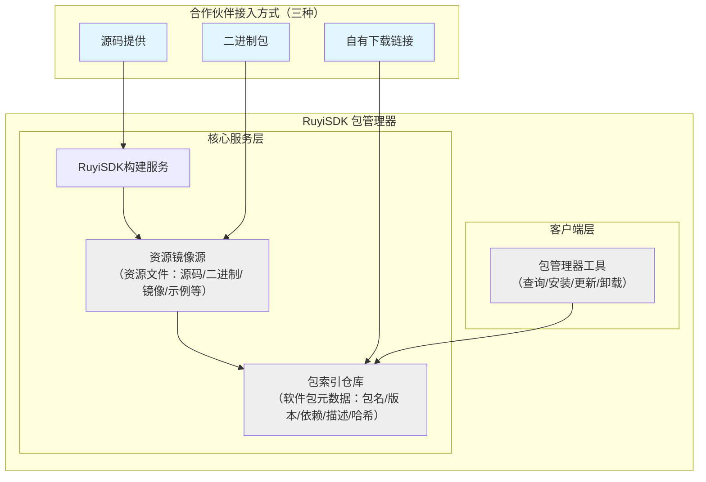

# RuyiSDK 生态资源接入指南

RuyiSDK 团队诚挚邀请合作伙伴共同建设 RISC-V 开发生态，为广大开发者提供丰富、可靠的开发资源。为明确合作流程，现将当前支持的资源接入模式说明如下，欢迎有意向的伙伴与我们联系。

## 1. RuyiSDK 包管理体系简介

RuyiSDK 包管理器（以下简称"包管理器"）专注于为 **RISC-V 架构开发者** 提供一站式的开发资源获取与管理体验，主要面向以下类型资源：

- **RISC-V 专用工具链**：编译器、链接器、调试器等
- **RISC-V 开发库和框架**：针对 RISC-V 优化的库文件、运行时环境
- **RISC-V 系统与硬件支持**：操作系统镜像、固件、硬件适配驱动
- **RISC-V 开发工具**：性能分析、模拟仿真、验证测试工具
- **RISC-V 生态软件**：已移植到 RISC-V 架构的关键应用软件
- **RISC-V 开发教学资源**：示例代码、教程文档、开发案例

**资源接入范围说明**：
我们优先接入**与 RISC-V 开发直接相关**的资源。对于通用的、非 RISC-V 特定的开发工具，建议通过其他渠道分发。如有不确定是否符合接入范围，欢迎在正式申请前与我们沟通确认。

体系架构如下：



体系核心由以下三部分组成：

- **包管理工具**：运行于开发者本地环境的客户端工具，支持在 Linux（兼容 Debian、Ubuntu、openEuler、Fedora、Arch Linux、Gentoo 等主流发行版，详见[RuyiSDK平台支持情况](https://ruyisdk.org/docs/Other/platform-support)）的 x86_64、aarch64 及 riscv64 架构上执行资源的查询、安装、更新与卸载。
- **包索引仓库**：集中存放软件包元数据（包名、版本、依赖关系、描述、哈希值等）的权威信息库。包管理器通过索引仓库获取软件包的定义信息，进而定位并获取资源文件。
- **资源镜像源**：托管和分发实际资源文件（如源码包、预编译二进制、系统镜像、示例代码等）的服务平台，支持多种压缩格式与资源类型，提供高速、稳定的下载服务。

合作伙伴可通过以下两种主要模式将资源接入该体系。

## 2. 资源接入模式

### 2.1 源码集成模式

此模式适用于提供开放源码的软件项目，由 RuyiSDK 团队负责构建与标准化分发。

**合作流程：**

1.  **资源提供**：合作伙伴提供软件项目的完整源代码。
2.  **授权要求**：合作伙伴需授权 RuyiSDK 团队使用该源码进行构建，并将生成的二进制包通过 RuyiSDK 官方渠道进行分发。
3.  **构建与打包**：RuyiSDK 团队根据项目特点与合作伙伴的建议，完成跨平台的编译、打包及质量测试。
4.  **发布与分发**：
    - 构建生成的二进制包将上传至 **RuyiSDK 官方资源镜像源** 供用户下载。
    - 该软件包的元数据（定义信息）将提交至 **RuyiSDK 官方包索引仓库**，完成软件包的"注册"。

**优势与建议：**
此模式适合尚未建立独立分发体系的优质开源项目。我们鼓励合作伙伴同步提供打包建议或构建脚本，以确保最终分发的软件包能符合原项目的设计意图与特性。

### 2.2 二进制分发模式

此模式适用于已拥有成熟构建发布流程，或不便提供源码的软件产品。合作伙伴提供预编译好的二进制文件，由 RuyiSDK 体系负责索引与分发。

根据二进制文件的托管方式，提供以下两种子方案：

#### 方案 A：镜像源托管分发

合作伙伴将构建好的二进制包交付给 RuyiSDK 团队，由其统一托管与分发。

**合作流程：**

1.  **资源提供**：合作伙伴提供已通过测试的二进制发布包，并明确其支持的系统架构（如 x86_64, riscv64）及发行版兼容性。
2.  **授权要求**：合作伙伴需授权 RuyiSDK 团队对提供的二进制包进行再分发。
3.  **托管与测试**：RuyiSDK 团队将二进制包上传至 **RuyiSDK 官方资源镜像源**，并进行基础的兼容性验证。
4.  **发布与分发**：
    - 二进制包通过 **RuyiSDK 官方资源镜像源** 提供下载。
    - 软件包元数据提交至 **RuyiSDK 官方包索引仓库**。

#### 方案 B：自有渠道直连分发

合作伙伴希望保持对二进制文件的完全控制，仅通过 RuyiSDK 体系提供发现与安装指引。

**合作流程：**

1.  **资源提供**：合作伙伴维护其软件包的公开下载链接，并将该链接提供给 RuyiSDK 团队。
2.  **技术要求**：下载服务器需允许携带 `User-Agent: ruyi/<版本号>` 头信息的 HTTP/HTTPS 请求访问，且**不支持**需要交互式登录或复杂鉴权的流程。对下载服务器而言，该请求与常规的 `wget` 或 `curl` 命令无异。
3.  **发布与分发**：
    - 二进制包通过 **合作伙伴的自有下载渠道** 直接分发。
    - 软件包元数据（其中包含下载链接）提交至 **RuyiSDK 官方包索引仓库**。用户通过包管理器安装时，将直接从合作伙伴的服务器获取文件。

**重要注意事项与维护要求：**

采用此模式时，**合作伙伴需承担二进制文件生命周期管理的主要责任**，包括：

- **链接稳定性承诺**：应确保提供的下载链接具备长期稳定性。建议使用具备持久性的 URL 策略（如内容寻址链接、版本化路径等），避免因网站改版或目录结构调整导致链接失效。
- **版本维护一致性**：当发布新版本时，需同步更新 RuyiSDK 包索引仓库中的元数据信息，确保版本号、哈希值、更新日志等信息的准确性和时效性。
- **失效应急响应**：若因不可抗力导致下载链接变更或失效，应**在48小时内**通过提交 Issue 或 Pull Request 的方式更新包索引仓库中的相关信息，避免影响开发者正常使用。
- **兼容性声明责任**：合作伙伴需自行确保二进制包与声明支持的平台和架构的兼容性，并在环境变更时及时更新兼容性说明。
- **长期维护预期**：建议仅在确保软件包具备至少**6个月**维护期的情况下选择此模式，避免短期项目对开发者造成困扰。

**技术对接方式：**
对于方案 B，技术能力较强的合作伙伴可以直接向 [RuyiSDK 包索引仓库](https://github.com/ruyisdk/packages-index) 提交 Pull Request，参考仓库中的贡献指南添加或修改软件包定义。我们鼓励采用自动化的方式同步版本信息，如通过 CI/CD 流程在发布新版本时自动更新包索引。

## 3. 协作流程

为规范合作流程，我们建议按以下步骤进行：

### 步骤一：初步联系
通过 RuyiSDK 官方渠道（如官网联系表单、指定邮箱等）与我们取得联系，简要说明希望接入的资源概况。

### 步骤二：正式提交
在 [RuyiSDK 包索引仓库](https://github.com/ruyisdk/packages-index) 创建 Issue，按照以下模板提供详细信息：

```markdown
## 资源接入申请

### 基本信息
- **资源名称**：
- **当前版本**：
- **项目官网/仓库**：
- **许可证类型**：
- **希望采用的接入模式**：□ 源码集成 □ 二进制分发-镜像源托管 □ 二进制分发-自有渠道

### 技术信息
- **支持的系统架构**：□ x86_64 □ aarch64 □ riscv64
- **支持的发行版/环境**：
- **资源类型**：□ 工具链 □ 库文件 □ 开发工具 □ 系统镜像 □ 其他（请说明）

### 接入详情（根据所选模式填写）

#### 若选择源码集成：
- 源码仓库地址：
- 构建依赖要求：
- 特殊的构建步骤或注意事项：
- 授权声明：□ 我代表版权方授权 RuyiSDK 团队使用上述源码构建并分发二进制包

#### 若选择二进制分发-镜像源托管：
- 二进制包下载地址（或交付方式）：
- 哈希值（SHA256）：
- 已测试的平台清单：
- 授权声明：□ 我代表版权方授权 RuyiSDK 团队对上述二进制包进行再分发

#### 若选择二进制分发-自有渠道：
- 稳定版下载链接模式（可使用版本变量如 {version}）：
- 是否提供多架构包：□ 是 □ 否
- 下载服务器技术要求确认：□ 确认支持带 User-Agent 头的匿名 HTTP/HTTPS 访问
- **维护承诺**：□ 确认理解并承诺履行上述维护责任，确保链接长期有效

### 联系人信息
- 姓名/团队：
- 邮箱：
- 其他联系方式（可选）：
```

### 步骤三：技术对接与授权
1. RuyiSDK 团队审核 Issue 信息，确认资源与 RISC-V 开发的相关性及技术可行性
2. 合作伙伴按要求提供正式授权文件或声明
3. 双方确认技术对接细节

### 步骤四：集成与发布
根据选择的接入模式，完成资源集成、测试并正式发布。

---
**说明**：对于熟悉 Git 工作流的合作伙伴，特别是选择"二进制分发-自有渠道"模式时，欢迎直接 Fork 包索引仓库并提交 Pull Request，我们将安排专人定期处理此类技术贡献。

我们期待与您携手，共同丰富 RISC-V 开发生态！
